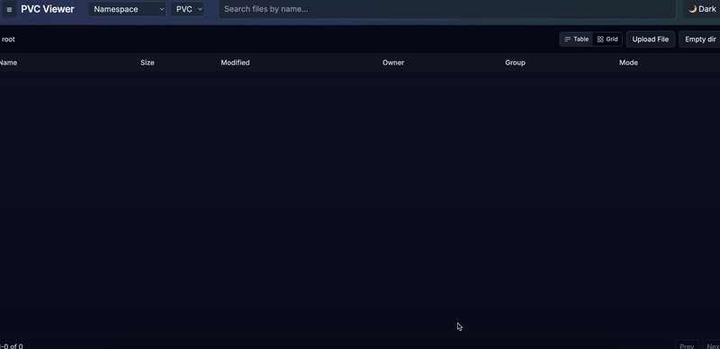

# PVC Viewer


Browse, download, upload (optional), and delete files on Kubernetes PersistentVolumeClaims with a modern, lightweight UI. Hot-reload configuration via ConfigMap, smart include/exclude matchers, and flexible data-plane modes:

- agent-per-namespace: one or more agents per namespace (grouped by security profile), each mounts matched PVCs at `/data/<pvc>`
- agent-per-pvc (recommended): one lightweight agent Pod per matched PVC, no restarts on config changes
- mount-in-backend: mount multiple PVCs directly into backend Pod (requires restart on changes)

The single container image embeds the React UI, backend API gateway/orchestrator, and agent binary.

## Features

- Hot-reload ConfigMap: update watched namespaces/PVCs/storageClasses without restarts (agent-per-pvc)
- Glob matchers (doublestar): include/exclude for namespaces, PVCs, storageClasses
- Agent (per-namespace or per-PVC): POSIX FS access; list/tree (pagination), range download with ETag, safe delete, upload (multipart), empty directory, path traversal protection
- Security per storageClass: fsGroup/supplementalGroups overrides, readOnly mode
- Simple UI (React + Vite + Tailwind): header (namespace/PVC selectors + search), left folder tree, right file table, inline preview (text/images/PDF), context menu, progress bar, error toasts
- Prometheus metrics endpoint (/metrics)
- Helm chart with RBAC, Service, Ingress (optional), NetworkPolicy, ConfigMap

## Demo



## Architecture

```
Web UI (static)  <—HTTPS—>  Backend (Go)
                                 ├─ ConfigMap watcher (hot reload)
                                 ├─ Reconciler (ensures agent Pods/Services)
                                 └─ Proxy to agents (HTTP, per‑PVC or per‑namespace group)

Data plane:
  • agent‑per‑namespace → one or more Pods per namespace (grouped by security profile)
  • agent‑per‑pvc       → one Pod per matched PVC

Agents (Go)
  └─ mount PVC at /data, file API (list/get/rm/upload/empty)
```

## Modes

- agent-per-namespace (default): creates one or more agents per namespace grouped by effective security profile (fsGroup/runAs/supplemental/readOnly). Each agent mounts matched PVCs at `/data/<pvc>`.
- agent-per-pvc: backend manages one lightweight agent per matched PVC (full hot-reload, no restarts)
- mount-in-backend: backend Pod mounts multiple PVCs (defined in values), requires restart on changes

## Installation (OCI Helm chart)

Install directly from public OCI registry (no login required).

```
# Install (pin versions as needed)
helm upgrade --install pvc-viewer \
  oci://ghcr.io/valeriikretinin/charts/pvc-viewer \
  -n pvc-viewer --create-namespace \
  --set image.repository=ghcr.io/valeriikretinin/kubernetes-pvc-viewer

```

Optionally enable Ingress in `values.yaml` (or via `--set`).

Note:
- The container image `ghcr.io/valeriikretinin/kubernetes-pvc-viewer` and chart `ghcr.io/valeriikretinin/charts/pvc-viewer` are published as Public packages. If you fork, make sure to set your GHCR packages visibility to Public to allow anonymous pulls.

See also the chart sources and detailed values in `helm/pvc-viewer/`.

## Configuration (ConfigMap)

Rendered to `/config/config.yaml` and hot-reloaded by backend.

```
watch:
  namespaces:
    include: ["*"]      # glob list; empty => match nothing
    exclude: ["kube-*"]
  pvcs:
    include: ["*"]
    exclude: []
  storageClasses:
    include: ["*"]
    exclude: []
mode:
  dataPlane: agent-per-pvc  # or mount-in-backend
agents:
  securityDefaults:
    runAsUser: 1000
    runAsGroup: 1000
    fsGroup: 1000
    supplementalGroups: [65534]
    readOnly: false
  securityOverrides:
    - match: "cephfs*"          # by storageClass glob
      fsGroup: 16777216
      supplementalGroups: [16777216]
    - pvcMatch: "airflow-*"     # per-PVC glob (takes precedence over match)
      runAsGroup: 50000
      fsGroup: 50000
    - match: "nfs*"
      fsGroup: 1000
```

### mount-in-backend specifics

```
config:
  mode:
    dataPlane: mount-in-backend
  mountPVCs:
    - pvcName: my-shared-cephfs
      mountPath: /mnt/cephfs
      readOnly: false
      subPath: ""   # optional
```

On changes to `mountPVCs` backend Pod will restart (checksum/config) to re-mount volumes.

## API (backend)

- `GET /api/v1/namespaces`
- `GET /api/v1/pvcs?namespace=<ns>&storageClass=<glob?>`
- `GET /api/v1/tree?ns=<ns>&pvc=<pvc>&path=<path>&limit=200&offset=0`
- `GET /api/v1/download?ns=<ns>&pvc=<pvc>&path=<file>` (Range/ETag supported)
- `DELETE /api/v1/file?ns=<ns>&pvc=<pvc>&path=<file|dir>`
- `POST /api/v1/upload?ns=<ns>&pvc=<pvc>&path=<dir>` (multipart)
- `POST /api/v1/empty-dir?ns=<ns>&pvc=<pvc>&path=<dir>` (remove all entries in directory)
- `GET /api/v1/pvc-status?ns=<ns>&pvc=<pvc>`
- `GET /api/v1/healthz`, `GET /api/v1/readyz`, `GET /metrics`

## Security

See the full security policy and hardening guidance in `SECURITY.md`.

## Metrics

Exposes `/metrics` (Prometheus). Add a ServiceMonitor if you use Prometheus Operator.

## Security & CI/CD

- Security scanning: Trivy image scan in CI; Trivy IaC scan for Helm chart.
- CI pipeline: Go build/test, UI build, Helm lint, Docker build/push (GHCR), Trivy scans.
- Actions: see badges above or visit the Actions tab.

## Contributing

Please read `CONTRIBUTING.md`. By participating, you agree to abide by our `CODE_OF_CONDUCT.md`.

## Changelog

See `CHANGELOG.md` for notable changes.

## Development

Optional (for contributors):

- Prereqs: Go 1.24+, Node 20 (only for local UI dev)
- Dev UI: `cd ui && npm i && npm run dev` (proxies `/api` to backend on :8080)
- Docker build (UI+Go inside image): `docker build -t pvc-viewer:dev .`
- Local binaries: `go build ./cmd/backend && go build ./cmd/agent`

## Project layout

```
cmd/backend        # backend main + embedded static
cmd/agent          # agent main
internal/backend   # reconcile/proxy/metrics/status
internal/agent     # HTTP file API
internal/config    # YAML config + hot-reload
internal/matcher   # include/exclude glob matchers
internal/kube      # k8s client factory
internal/fsutil    # secure path utils
ui/                # React + Vite + Tailwind UI
helm/pvc-viewer    # Helm chart
```

## Roadmap

- Leader election for HA
- Full PVC status set (MountBlocked/ReadOnly) and richer UI badges
- Rate limiting & size limits (upload/download) + audit log
- OIDC/JWT AuthN/Z and RBAC mapping (patterns)
- EndpointSlice caching for agent proxy

## License

Apache-2.0